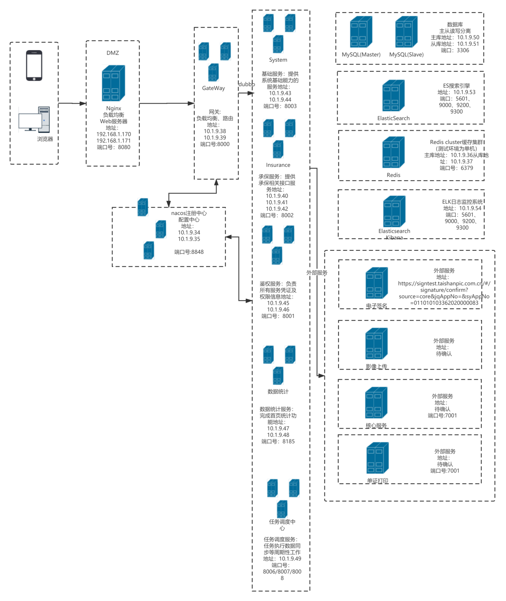

## 生产数据库访问：

1.登录194，ssh到生产数据库，密码kscd
2.登录193， ssh到生产服务器，密码kscd

## 生产服务器资源：

``` 
项目	   ip	       部署说明	  下发用户 下发密码	   暴露端口		内网域名
快速出单生产	10.1.9.31	Jenkins	      kscd	   kscd	  8080		jenkins.kscd.tsbx
快速出单生产	192.168.1.170 nginx       kscd	  kscd	  8080/8081	nginx01.kscd.tsbx
快速出单生产	192.168.1.171 nginx       kscd	  kscd	  8080/8081	nginx02.kscd.tsbx
快速出单生产	10.1.9.34	nacos	      kscd	   kscd	  8848		nacos01.kscd.tsbx
快速出单生产	10.1.9.35	nacos	      kscd	   kscd	  8848		nacos02.kscd.tsbx
快速出单生产	10.1.9.36	redis	      kscd	   kscd	  6379		redis01.kscd.tsbx
快速出单生产	10.1.9.37	redis	      kscd	   kscd	  6379		redis02.kscd.tsbx
快速出单生产	10.1.9.38	app/gateway	   kscd	 	 kscd	8000	  app01.kscd.tsbx
快速出单生产	10.1.9.39	app/gateway	   kscd		 kscd	8000	  app02.kscd.tsbx
快速出单生产	10.1.9.40	app/insurance	kscd	  kscd	 8002	   app03.kscd.tsbx
快速出单生产	10.1.9.41	app/insurance	kscd	  kscd	 8002		app04.kscd.tsbx
快速出单生产	10.1.9.42	app/insurance	kscd	  kscd	 8002	 	app05.kscd.tsbx
快速出单生产	10.1.9.43	app/system		kscd	  kscd	 8003		app06.kscd.tsbx
快速出单生产	10.1.9.44	app/system		kscd	  kscd	 8003		app07.kscd.tsbx
快速出单生产	10.1.9.45	app/auth		kscd	  kscd	 8001		app08.kscd.tsbx
快速出单生产	10.1.9.46	app/auth		kscd	  kscd	 8001		app09.kscd.tsbx
快速出单生产	10.1.9.47	app/es			kscd	  kscd	 8004		app10.kscd.tsbx
快速出单生产	10.1.9.48	app/es			kscd	  kscd	 8004		app11.kscd.tsbx
快速出单生产	10.1.9.49	app/job			kscd	  kscd	 8006/8007/8008	app12.kscd.tsbx
快速出单生产	10.1.9.50	mysql			kscd	  kscd	 3306		mysql01.kscd.tsbx
快速出单生产	10.1.9.51	mysql			kscd	  kscd	 3306		mysql02.kscd.tsbx
快速出单生产	10.1.9.52	promethous		kscd	  kscd	 9090/3000	prometheus.kscd.tsbx
快速出单生产	10.1.9.53	es_search		kscd	  kscd	 9100/9200/9300/5601	essearch.kscd.tsbx
快速出单生产	10.1.9.54	es_log			kscd	  kscd	 9100/9200/9300/5601	eslog.kscd.tsbx

```


## 环境账号密码

UAT账号密码：
http://124.128.232.193:9090/api_uat/ins/api/manual_job/UserJobHandler

PROD账号：
https://kc.taishanpic.com.cn/api_prod/ins/api/manual_job/UserJobHandler

### vpn账号密码：
123456wyc!@# 

## 批改原因小项：

1.03 变更客户信息，投、被保人添加证件是否长期标识字段“identifyEndDateMrk”
2.10 变更车牌信息，添加是否上牌标识字段“isPlateNo”
3.15 变更车辆信息（其它），暂用验车情况这一个字段判断，数据库数据没陕